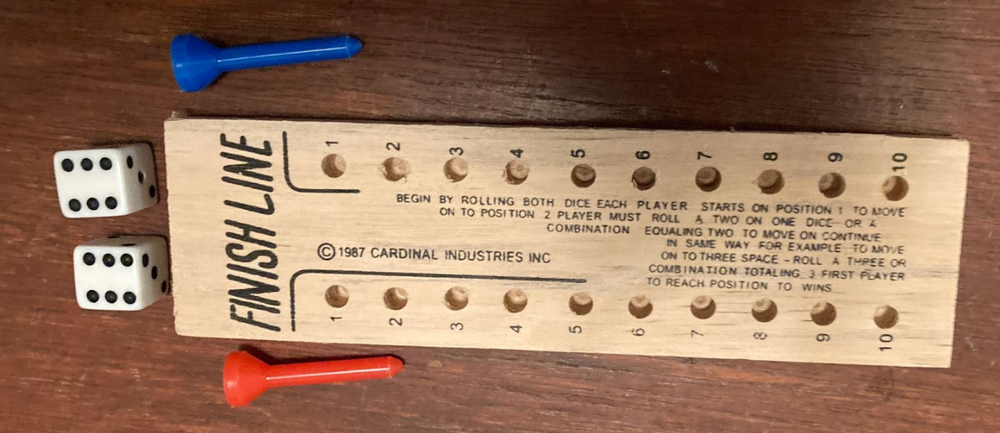

# FinishLine Game

FinishLine is a simple turn-based game for two players where the objective is to reach the finish line, which in this case is position 10.

## How to Play

1. **Initialization**: 
   - Players start at position 1.
   - The game initializes the number of turns to 0.

2. **Game Loop**: 
   - The game continues until one player reaches position 10.

3. **Each Turn**:
   - The current player rolls two dice.
   - The dice rolls are displayed.
   - The player moves forward based on the sum of the dice rolls if their current position matches any of the dice rolls or their sum.
   - The player's position after the move is displayed.
   - The turn count is incremented.

4. **Win Condition Check**: 
   - After each turn, the game checks if either player has reached position 10.
   - The game declares the respective player as the winner if they reach position 10.

5. **End of Game**: 
   - The game loop ends when one player reaches position 10, and the winning player is announced.

## Components

- **`Main.java`**: Contains the main method to run the game.
- **`FinishLine.java`**: Defines the `FinishLine` class which represents the game logic.

## How to Run

1. Clone the repository to your local machine.
2. Compile the Java files.
3. Run the `Main.java` file to start the game.

